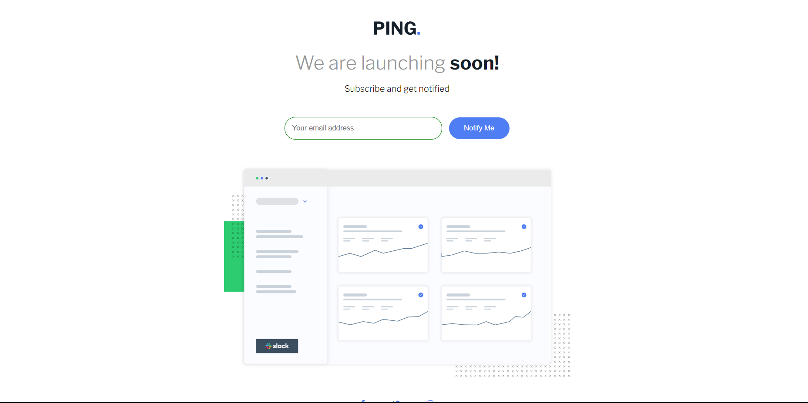
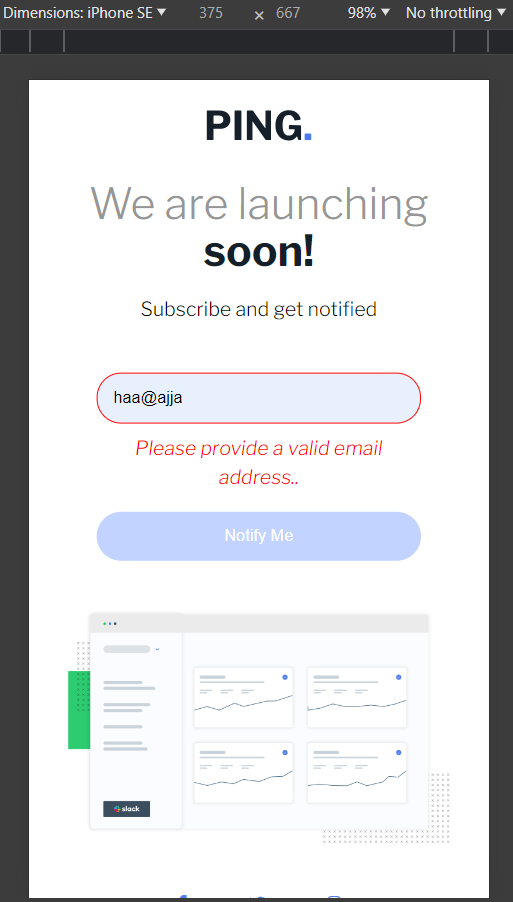

# Frontend Mentor - Ping coming soon page solution

This is a solution to the [Ping coming soon page challenge on Frontend Mentor](https://www.frontendmentor.io/challenges/ping-single-column-coming-soon-page-5cadd051fec04111f7b848da). Frontend Mentor challenges help you improve your coding skills by building realistic projects.

## Table of contents

- [Overview](#overview)
  - [The challenge](#the-challenge)
  - [Screenshot](#screenshot)
  - [Links](#links)
- [My process](#my-process)
  - [Built with](#built-with)
  - [What I learned](#what-i-learned)
  - [Continued development](#continued-development)
  - [Useful resources](#useful-resources)
- [Author](#author)

## Overview

### The challenge

Users should be able to:

- View the optimal layout for the site depending on their device's screen size
- See hover states for all interactive elements on the page
- Submit their email address using an `input` field
- Receive an error message when the `form` is submitted if:
  - The `input` field is empty. The message for this error should say _"Whoops! It looks like you forgot to add your email"_
  - The email address is not formatted correctly (i.e. a correct email address should have this structure: `name@host.tld`). The message for this error should say _"Please provide a valid email address"_

### Screenshot




### Links

- Solution URL: (https://github.com/hassanmoaa/ping-single-column-landing-page-FrontEndMentor.git)
- Live Site URL: (https://jade-begonia-bb7ead.netlify.app/)

### Built with

[](https://skillicons.dev)

### What I learned

I Completed a basic client-side form validation for the first time, **I learnt (regex)-Regular Expressions** and how to manipulate the DOM effectively to ensure User's simple navigation, also added `aria-live: polite` in the HTML so it's accessible by **Screen Readers Too**.

```
formEl.addEventListener('submit', (e) => {
	e.preventDefault(); // Prevents the default submit behavior

	validateEmail();
});

const validateEmail = () => {
	// Check if email is empty
	const regex = /^[A-Za-z\._\-0-9]*[@][A-Za-z]*[\.][a-z]{2,4}$/;

	if (!email.value.match(regex)) {
		errorMsg.innerHTML = 'Please provide a valid email address..';
		errorMsg.style.color = 'red';
		email.style.borderColor = 'red';
		return false;
	} else {
		errorMsg.innerHTML = '';
		email.value = '';
		email.style.borderColor = 'green';
		return true;
	}
};

```

### Continued development

- Full Stack Development

### Useful resources

- (https://developer.mozilla.org/)
- (https://www.w3schools.com)

## Author

- Frontend Mentor - [@hassanmoaa](https://www.frontendmentor.io/profile/hassanmoaa)
